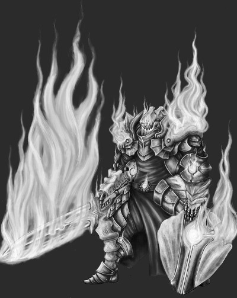
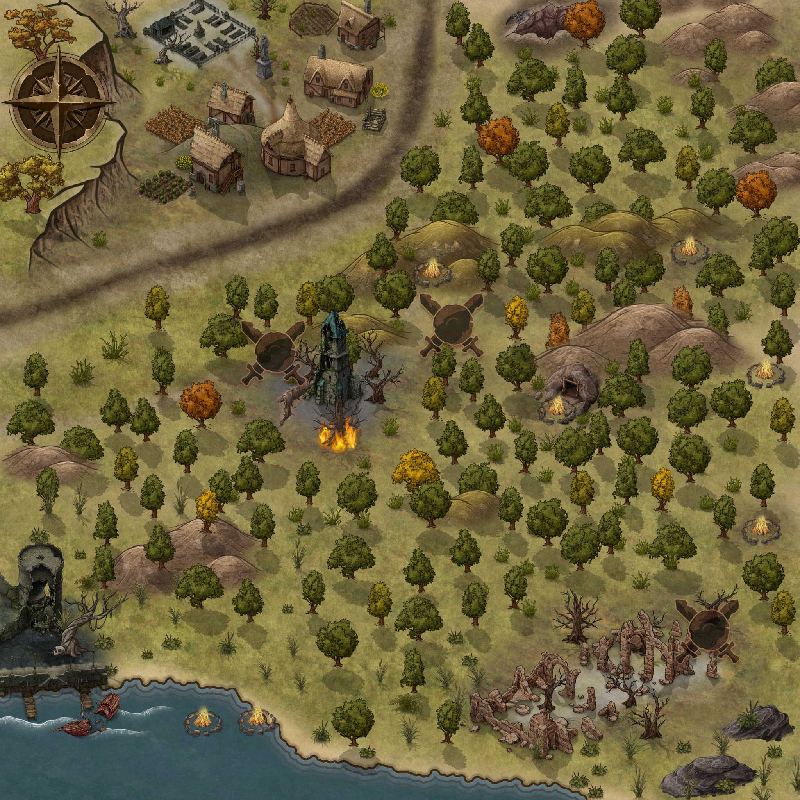

	A sword and its story...
	https://loottheroom.itch.io/go-alone

# Preface

_You play a sentient magic sword. You are centuries old and
have seen and done terrible things, often in the pursuit of some
misguided quest for glory and power. Everyone who has ever
wielded you has died, and you have spent more time alone in
the dark places of the world than you have spent in the hands of
someone who would put you to work..._

# Prologue

_One day since this new bearer plucked me from the dark. How long has it been
since I was last left there? I don’t remember. But it feels good to be held
again, to feel the warmth of mortal flesh around my hilt. Soon I will be put
to work again, made to rip and tear as I was built to do. Part of me thirsts
for it, longs to feel the bite of meat again, but the rest of me feels nothing
but disgust and fatigue. I have served for so long, been discarded so many
times. Surely it’s time I was allowed to rest for good?_

[Dragon Warrior by inanimatealex, www.deviantart.com](https://www.deviantart.com/inanimatealex/art/Dragon-Warrior-Sketch-wip-3-409933055)

\newpage

# The Story

## Day 1 -- A new friend

> _Noble heroes, my sword and yours are kin. Good sparks and lustrous, a word, 
> good metals._ -- All's Well That Ends Well

She came for me through the dark; I could sense her just as she could sense
me. I could see the pale red glow that surrounds her as she made her way
through the ruined city heading straight to me. 

I have been lying here in the gloom for almost 20 years enjoying the peace and
quiet. Lying next to my last bearer, Grimstone the Dwarf.  Well, what's left
of him after feeding the local rats for all those years. We had helped storm
this city when it was the centre of the Undead King's empire and he made an
unwise decision to see what he could "liberate" from the treasury just before
a couple of enraged trolls decided to stomp through the building. He wasn't
too bad, just a little too greedy at the wrong time.

I knew that one day I would be found and put back to work, but there was just
that faint hope that it might not happen this time. Although, I have to admit
it, I am a little thrilled by this new bearer: it has been a very long
time since I have been in the presence of an _Elemental Warrior._  I wonder
what she wants from me.

She picks me up by the hilt and smiles.  It appears that this will be a new
chapter of my life and I wonder what we will accomplish. We introduce
ourselves, she is called Allegra and she is a bodyguard. This is a little
confusing, why is an Elemental doing such a mundane job?  Who is she
protecting? I assume that I will meet them soon.

## Day 2 -- An old friend

As Allegra climbs out of the ruins we are met by some of the locals. I have
heard them over the years looting what remains of the city and, I assume,
selling whatever they find. But the plunder must be getting bare lately as
they have been through the city time and time again. Luckily for me, they are
a suspicious lot and Grimstone's skeleton kept them away from me.

So, on one side we have an Elemental Warrior with an enchanted sword and the
other side is half a dozen peasants armed with rusty weapons handed down from
their grandparents. I expected them to be very polite, says "good morning
madam" and quietly disappear. But things must be getting desperate and their
greed overrode common sense (a bit like Grimstone). They demanded that Allegra
drop her valuables and leave. 

She did not comply and we proceeded to defend ourselves. I suppose _slaughter
them_ would be a better turn of phrase. I must say that she is a wonderful
partner, such fluid movement, perfect balance and gentle touch. Over the years
I have had to control my bearer to direct their clumsy attacks and protect
them in a fight, but Allegra showed me what a true artist can do. I really had
nothing to do but watch the action. 

It was over in a few minutes leaving me covered in their blood. Much to my
surprise, Allegra not only cleaned me but also applied some oils to my blade.
Caught a little off guard I thanked her and completed the introductions by
telling her my real name, something I only do for bearers that show her level
of skill. She actually knew some of my story, how I was forged by the elves
in Baden Nur to kill the dragon Razeroth; and succeeded, of course.

I did not mention what Razeroth did before he died. That's something I have to
be very careful with.

After a short rest we continued, leaving the city and travelling North through
the forest eventually arriving at a small camp site where I saw the person she
is protecting.

I know him. In fact, a thousand years ago I tried to kill him.

Cassius the Necromancer. 

## Day 3 -- Betrayal 

Well, this is going to be interesting. Cassius looks like he's only aged a few
years: a bit of grey in his hair and some wrinkles. But the strange thing is
that he doesn't know me. Surely someone of his power can sense me, just like
Allegra did.  And yes, it is him and not someone who looks like him. When you
have killed as many people as I have you get to know death and Cassius is
definitely the Necromancer I met all those years ago. 

I immediately tell Allegra who he is and demanded that we finish him off as
quickly and painfully as we can. She did nothing. I screamed at her. She did
nothing. 

She placed me into a scabbard on one of the horses and quietly spoke to him
about his day while a servant prepared the evening meal. This scene of
domesticity drove me further into spasms of rage. Someone is going to pay for
this.

## Day 4 -- Memories of the past

I often wonder what type of creature I would be if I wasn't in this form. Last
night it would liked to have been a giant so I could crush everyone in this
camp and finish off Cassius and erase my failure from the past.

Something strange happened this morning as the camp woke. The servant, Garth,
was up first and began preparations for breakfast. Cassius woke and stood up, he
stretched and looked at Garth.

> _Who are you?_ he asked.

What? Last night they spoke and joked as if they were old friends. Garth
explained, I'll summarise it as the discussion went on for a while over
breakfast.

> _I am Garth your servant. You are Cassius. You have been enchanted some time
> ago and forget who you are each night as you sleep. We have been together for
> some time. Myself and Allegra travel with you._

Garth said nothing about Cassius' past just his current affliction. Also,
nothing about removing the curse. How long ago was he cursed?  How long have
they been travelling? I need to talk to Allegra about this: is she really his
bodyguard or could she be his jailer?

Too many questions for my liking. 

After breakfast, and further discussions, they pack up the camp and continued
travelling North. Allegra leaves me on the pack horse and we don't speak.
Cassius' memory seems to be fractured and parts of it surface during the day.
At one point he asks if we are travelling to Frostford as the wizards there
might be able to help him. His companions are non-committal. As far as I can
recall Frostford was destroyed hundreds of years ago. This is something to
note: Cassius still has limited knowledge of the past.

I listen carefully to their discussions as we travel to see what I can gather
and maybe try to guess what is happening and how long it has been going on.

## Day 5 -- Ghosts

Another day of travel and no answers. At breakfast Garth repeats yesterday's
script, does he get bored giving the same talk each morning?

What does Allegra want from me? Why did she hunt me down? 

With nothing else to do I am left to ponder the big questions of life. Not
really, I day-dreamed of the past and the people I have known and killed.

I have been used by Kings to carve out empires and drunks to kill their
friends. When Grimstone and I stormed into the city our target was the witch
Mortwella, the Undead King's second in charge. It was a good fight, but I feel
that she lost only because she was distracted by the destruction of the city
around her. Once we had dispatched her, Grimstone had decided that he needed
to be rewarded for his efforts. We know how well that went.

With Cassius so close, I would have thought that my failure to kill him would
have been my biggest regret, but it is always that drunken idiot Sven and him
showing off to his so-called friends. He was the local grave digger and was
secretly robbing the mausoleums to obtain money for booze. He found me in one
of them and had decided to show off to his friends in the local tavern.

Throughout the evening the crowd had gotten him drunk and egged him on as he
staggered around the tavern swinging me as if he was battling a whole army.
While striking at his one of his imaginary enemies he had slipped and before I
could do anything had sliced one of the barmaids in half. I could still see
her sister screaming at us from the other side of the room.  The crowd
soon became a lynch mob and dragged Sven out into the fields. One of the more
enterprising souls stole me and a few days later sold me to a blacksmith.

## Day 6 -- Duties

Repeat the breakfast scene again.

Allegra unsheathes me and while the other two are busy repeating themselves again
we wander off to the forest to scout the area. We have stopped at the edge of
a forest atop a small hill. As we arrived late yesterday I would glimpse the
lights of a town through the thinning trees at the edge of this copse.

She finally reveals what is happening and why she deliberately sought me out.
Much of what she told me has been passed down the generations of warriors who
guard Cassius and the details have been lost over time. In one way I was correct,
she is his jailer but she is also his executioner. 

To summarise the tale: when we failed to kill Cassius all those
years ago he had escaped through a tunnel system under his castle. As he
exited the tunnels he ran into our "Plan B" -- a handful of wizards waiting to
ambush him. Wounded & distracted by our attack he could not evade them and
they managed to knock him out and transport him away. I was not aware of this
as they had previously decided to keep the capture secret and tell everyone
that Cassius has escaped the ambush. The aim of this deception was to keep
people looking for him and to reduce the possibility of a rescue attempt by
his allies.

Unable to kill Cassius (you know, the Necromancer) the wizards came up with a
plan to curse him: each night while he slept he would forget who we was.

Allegra, and her predecessor, are becoming alarmed that the curse is wearing
off and Cassius is beginning to remember his past life. Perhaps that's why he
asked about the old city of Frostford the other day?

Did I mention that Allegra is also his executioner? I was to be the instrument
of that act. I believe that this is the first time that I've been able to have
a second attempt. When my sister and I were forged, the elves Adoel and
Eledhwen had vowed to kill the dragon Razeroth and we had succeeded. That was
the first of a long long line of successes. Cassius was by biggest failure and
it looks like I might get a second go!

I wish my sister was here with me. I remember her singing as we fought
together. With her at my side I would have never had failed the first time.
But she had been lost before the Undead King had arisen and spawned Cassius
and his kin.

## Day 7 -- Lost and found

Repeat the breakfast scene again. But this time I watch carefully to see if
Cassius has changed. I didn't notice anything different from the previous
days, but could I tell? Cassius is certainly capable of hiding his recover
from us.

Allegra has decided to carry me and swaps swords, the old (boring) one now
rides with the pack horse. Alright, maybe I exaggerate, the old sword belonged
to her father who taught her to use it when she was little. Allegra grew up in
a town that was situated on a trade route making it a valuable target for the
local bandits. The town was often raided and as a result everyone in the town
had some form of military training to help defend the town and the caravans
that had stopped to rest. It sounds like it was a good arrangement: develop a
skilled fighting force and make the town a safehaven for the wealthy traders
travelling along the trade route.

Allegra's father had been killed in one of these raids. Some time after, she
decided to join one of the caravan to get away and travel the world --
something that her father had always wanted her to do. I'm still waiting to
find out how she became an elemental, I understand that the process can be
traumatic. 

In one way, we have both suffered a loss of family that continues to haunt us
both: my sister and her father. 

Lost in my own thoughts I did not see the ambush until Allegra swung me at the
head of one of the attackers. Much to my shame I flinched and missed, allowing
the attacker to wound Allegra in her sword arm. Anger at my clumsiness burnt
through me and I flexed my powers and tried my best to seal the wound. The
trees lit up with Allegra flames, enhanced by my powers, and we finished off
the attackers quickly. I hope that she did not notice my mistake.

Allegra ordered Garth and Cassius to change direction and travel south to find
a hiding spot. She dismounted and quickly searched the attackers. This lot
isn't your normal bandits. They are all dressed in some sort of uniform. No,
it isn't a uniform but more of a religious habit: leather clothes, a cloak and
cowl. Are the cultists of some form?

I guess someone else knows about Cassius.

## Day 8 -- Silent night

Garth and Cassius had found a cave for tonight's camp site. We didn't risk
starting a fire, so we spent an uneasily night in the dark. Allegra and I
keeping watch for any further attacks.  To the west is some sort of tower and
from what I can see it has been abandoned for a while, the tower showing the
ravages of time. Later that night the moonlight shines through the holes in
the stonework.

Gwen was her name. The barmaid. Even though I have tried to forget, the scene
keeps playing in the mind. Especially on nights like this: the moonlight
lighting the land with a silver glow and the quiet of the night as Sven was
dragged out of the tavern into the field.  I have killed so many people,
high-born people like Mortwella who commanded armies and controlled empires,
to the lowly soldiers that guarded the doors to her castle. But the barmaid is
always there filling the nocturnal silence.

## Day 9 -- Ambush again

Repeat the morning ritual. Nothing to report on Cassius' condition, it appears
to be unchanged. We pack up camp and start moving south-west to skirt the tower.

I was wrong about the tower: it was not abandoned. As we passed it there was a
growl from the shadows. 

How many times have I been in this situation: something nasty springing out of
the shadows to attack me and my bearer.  There had been dragons, demons,
trolls, orcs and one time it was a _mimic_ (a treasure chest with a big mouth
and nasty teeth). As I relived these past ambushes I forgot to concentrate on
this one. This time it was an ogre and he was one of the biggest I've seen and
armoured as well. The ogre swung his club at Allegra I was caught off guard
and just managed to block the club awkwardly. The momentum of his charge added
to the force of the blow and almost shattered me.

He fell to the ground and took a lucky swing at Allegra while he was rising. I
had been knocked back too far to prevent him striking her, the club hitting her
knee and ricocheting into her stomach. Her armour prevented any major wounds
but the force of the impacts almost knocked her off her horse. Luckily Garth
that his wits about him and managed to loose some arrows at the ogre which
distracted him enough for Allegra and I to recover and fend him off.

The ogre charged at us again. I could feel Allegra's flames building and
adding my own powers we ignited one of the dead trees surrounding the tower.
The ogre was startled by the flames and we got a luck blow in before everyone
retreated back into the forest. 

Allegra's injuries are not life threatening but she needs to rest for a day or
two. We double back to the cave we used last night to recover. 

You don't get to be my age and not be a little paranoid. The ogre was 
equipped with a metal club and well made armour. I wonder whether our
encounter was an accident or he was waiting for us?

## Day 10 -- Rest in peace

Repeat our morning scene. This time I notice that Cassius nods and smiles at
the revelations just a fraction of a second before Garth gets to the good
bits. Perhaps it's my imagination, fuelled by the ambushes over the last few
days.

We rest today in the cave. Allegra resting to recover from the ogre's attack
with Garth standing guard. Cassius sits quietly at the back of the cave
reading by the light of the small campfire.

Toward the evening when it starts to get dark Garth and Allegra swap roles. He
moves deeper into the cave to be with Cassius and Allegra and I settle down
just inside the cave mouth. She starts to nod off near midnight but I stay
alert (I don't sleep). A few hours later I notice someone creeping
through the brush heading towards us. I wake Allegra and we silently move out
of the cave into the darkness to intercept them. I have to admit I find this
thrilling: the tension as we quietly move through the brush and the killing
stroke as Allegra drives me through his heart. 

It was another of those cultists but there is no sign of any others. Perhaps
they have split up and are searching for us through the forest. 

Just and idle thought: in both encounters the cultists have come from the
north-west. I wonder whether they originate from the village I saw the other
night?

## Day 11 -- there's always a first time

Repeat the morning ritual. Cassius appears to be the same.

Around mid-morning Allegra and I decided to scout the area. Coincidently our
suspicions follow the same path: could our enemies originate from the local
village? We cautiously move through the forest to get a better look at the
village from some nearby hills. We arrived about midday and stayed for a few
hours observing the villagers go about their daily routine. Nothing suspicious
happens.

Bored by watching nothing happen we leave. Before we return to the cave we
decide to scout the tower to the south to see if the ogre is about.

Well, bits of him are. As we approach the tower we can see the remains of the
ogre lying in the ruins of the ground floor. His body and armour have been
shredded. Remember when I said that Grimstone was _too greedy at the wrong
time?_ Well, we were too curious at the wrong time. As we crept closer to the
tower to get a better look, the ground collapsed underneath us. We fell into a
tunnel and standing before us was an **Umber Hulk.**  I have only heard about
these creatures and have never encountered one before.

It was nasty fight: trapped in the narrow tunnel we could only retreat
backwards further into the depths hoping that there was nothing else waiting
for us. The Hulk was covered in armoured plates and the confined space prevent
Allegra from striking with full force. In desperation I dug deep and spoke to
Razeroth hidden inside me. The old dragon was amused by the situation but
agreed to my request. He added to my power and along with Allegra's skill we
cut though the heavy plates wounding the beast enough for it to turn and
retreat. 

We return back to the cave beaten and bruised again. The dragon humming to
itself. Did Allegra notice anything?  

## Epilogue

I don't sleep, but I can't remember last night. The last thing I do remember is
the usual "good night" wishes as everyone falls asleep.  Someone picks me up. 

It is Cassius and as he raises me into the air I see the bodies of Allegra and
Garth lying in their bedrolls. I can feel Razeroth stirring.

Cassius smiles, and says _"I think we are going to have a wonderful adventure together."_
